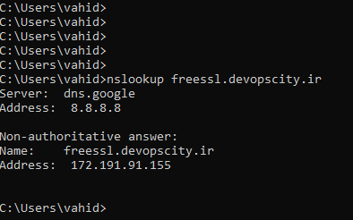

# prerequisites Prometheus and Grafana


Introduction: Welcome to the new episode, from the <mark style="color:green;">**DevOps Engineer package**</mark> available at **www.devopscity.ir .**This tutorial has been produced by <mark style="color:orange;">**Vahireza Jafary**</mark>. Throughout this demonstration, we will delve into <mark style="color:orange;">**Prometheus and Grafana,**</mark> advancing through this course in a practical, project-oriented manner.



## <mark style="color:orange;">prerequisites</mark>&#x20;

1. <mark style="color:green;">**Nginx**</mark>
2. <mark style="color:green;">**DNS Server**</mark> ( Optional )
3. <mark style="color:green;">**SSL Certificate**</mark> ( Optional )


<mark style="color:green;">**1.1   Installing Ngnix**</mark>

* <mark style="color:blue;">**Install Nginx**</mark>

```
apt install nginx -y
```

* <mark style="color:blue;">**Enable Ngnix Auto-Start at System Boot**</mark>&#x20;

```
systemctl enable nginx 
```

* <mark style="color:blue;">**Check NGINX status**</mark>&#x20;

```
systemctl status nginx
```

* <mark style="color:blue;">**Check NGNIX Welcome Page**</mark>

```
Search Your IP Address In Browser
/
nc -v x.x.x.x 80
```

<mark style="background-color:green;">Done</mark> ✔✔✔


<mark style="color:green;">**2.1     DNS Server**</mark>

In this Section , i'm using Arvancloud DNS provider. You can perform the same steps with any other DNS provider as well, like Cloudflare or ... .


**In the **<mark style="color:blue;">**CDN**</mark>** section, **<mark style="color:blue;">**DNS records**</mark>**, here we add our new **<mark style="color:blue;">**A record**</mark>**.**


<figure><figcaption></figcaption></figure>


Check by Nslookup command or Search in your new Sub Domain in Browser.


<figure><figcaption></figcaption></figure>


<mark style="background-color:green;">Done</mark> ✔✔✔


<mark style="color:green;">**3.1   SSL Certificate**</mark>

To obtain an Free SSL Certificate, we use the certbot service. For more details, you can visit the [https://certbot.eff.org](https://certbot.eff.org/) website .

* **Installing Certbot** Using Snap Package Manager on Ubuntu

```
sudo snap install --classic certbot
```

```
 sudo ln -s /snap/bin/certbot /usr/bin/certbot
```

* **get a certificate** and Let Certbot edit your **nginx configuration** automatically

```
sudo certbot --nginx -d X.YOURDOMAIN.AZ
```

🎁   Now you have a free Certificate and you can use it on your servers without any issues.

* **Automatic Renewal**

```
sudo certbot renew --dry-run
```


**I strongly Recommend automat this process of requesting a new SSL certificate using either crontab or systemctl list-timers.To do this, you can refer to the "crontab" section in my Linux tutorials.**


<mark style="background-color:green;">Done</mark> ✔✔✔&#x20;


