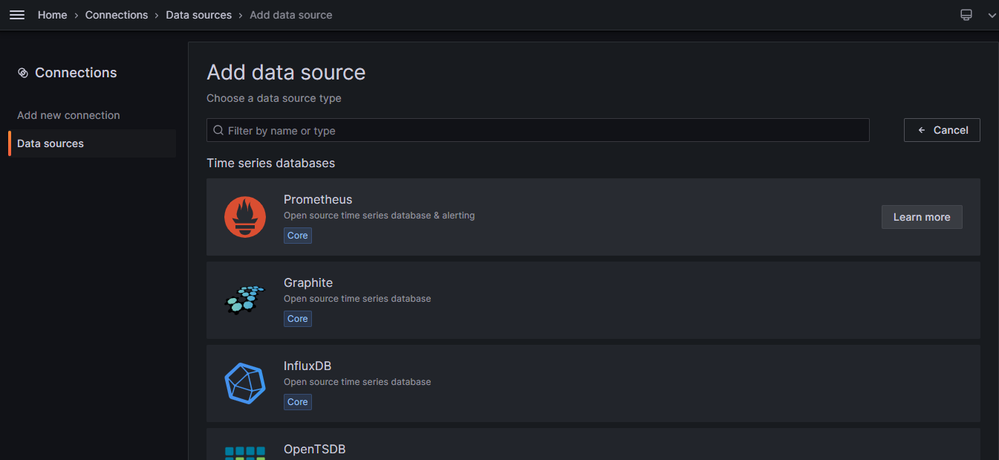

# Grafana Dashboard


In the previous step, we saw how to install Grafana. In this step, we will see how to connect it to Prometheus and set up the Grafana dashboard.


* **Add Prometheus Inside Grafana Dashboard As Datasource**&#x20;

<figure><figcaption>
<mark style="color:blue;"><strong>Grafana Dashboard create data source</strong></mark>
</figcaption></figure>

<figure><figcaption>
<mark style="color:blue;"><strong>Prometheus as preferred data source</strong></mark>
</figcaption></figure>

<figure><figcaption>
<mark style="color:blue;"><strong>Enter the hostname or ip address of prometheus server e.g. http://localhost:9090</strong></mark>
</figcaption></figure>

<figure><figcaption>
<mark style="color:blue;"><strong>Save and test prometheus datasource</strong></mark>
</figcaption></figure>


**After settings the data source we can import pre-existing opensource dashboard from** [**Grafana Labs**](https://grafana.com/grafana/dashboards/) **using the Dashboard ID.**


* Goto [Grafana Dashboard](https://grafana.com/grafana/dashboards/) and search for What you looking for.(Example CPU Usage)

<figure><figcaption></figcaption></figure>

* <mark style="color:blue;">**Click on the result and copy the Dashboard ID or URL**</mark>

<figure><figcaption></figcaption></figure>

* Goto Back to Grafana, Dashboard => New => **Import**

Enter the Dashboard ID or past URL

<figure><figcaption></figcaption></figure>

<figure><figcaption></figcaption></figure>

<mark style="background-color:green;">**Done**</mark> ✔✔✔
