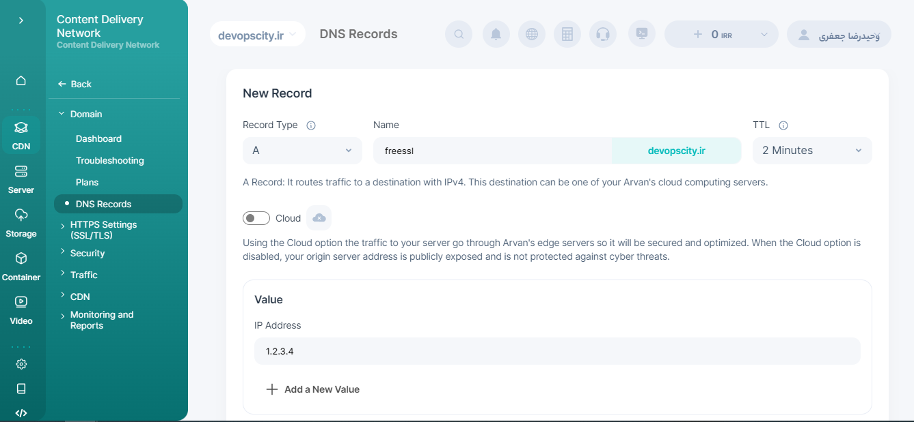

---
layout:
  title:
    visible: true
  description:
    visible: true
  tableOfContents:
    visible: true
  outline:
    visible: true
  pagination:
    visible: true
---

# Practical installation of Prometheus and Grafana



We start with the final part of the tutorial for installing Prometheus and Grafana on an Ubuntu server. I would be happy if you could watch the previous sections to have a better understanding of this part.



<mark style="color:orange;">**The steps to perform the task will be as follows:**</mark>


1. <mark style="color:green;">**Setup Nginx**</mark>
2. <mark style="color:green;">**Setup DNS Server**</mark>
3. <mark style="color:green;">**Get Free SSL**</mark>
4. <mark style="color:green;">**Install Prometheus**</mark>
5. <mark style="color:green;">**Install Node Exporter**</mark>

&#x20;     5.1 <mark style="color:green;">**On local Machin**</mark>

&#x20;     5.2  <mark style="color:green;">**On Remote Linux Server**</mark>

&#x20;     5.3 ** **<mark style="color:green;">**On Remote Windows Server**</mark>

6. <mark style="color:green;">**Install Grafana**</mark>
7. <mark style="color:green;">**Setup Grafana Dashbord**</mark>


&#x20;                                                                                <mark style="color:red;">**Let's do it**</mark>


<mark style="color:orange;">**1.1 Installing Nginx**</mark>

```
apt install nginx -y  &&  
systemctl enable nginx  && 
systemctl status nginx
```

<mark style="color:blue;">**Check NGNIX Welcome Page**</mark>

```
Search Your IP Address In Browser
/
snap install links  && 
links 127.0.0.1 
```

<mark style="background-color:green;">**Frist Step Passed !**</mark>


<mark style="color:orange;">**2.1**</mark> <mark style="color:orange;">**Setup DNS Server**</mark>



In this Section , i'm using Arvancloud DNS provider. You can perform the same steps with any other DNS provider as well, like Cloudflare or ... .

We add 4 Servers:

1- Prometheus server ( Called = Prometheus)

2- Mail Server ( Called = Mail )

3- Window Server ( Called  = Console )

4- Grafana Server ( called = Grafana )


**In the **<mark style="color:blue;">**CDN**</mark>** section, **<mark style="color:blue;">**DNS records**</mark>**, here we add our new **<mark style="color:blue;">**A record**</mark>**.**


<figure><figcaption></figcaption></figure>

<mark style="background-color:green;">**Second Step Passed !**</mark>


<mark style="color:orange;">**3.1**</mark>  <mark style="color:orange;">**Get Free SSL**</mark>



To obtain an Free SSL Certificate, we use the certbot service. For more details, you can visit the [https://certbot.eff.org](https://certbot.eff.org/) website .


<mark style="color:blue;">**Installing Certbot Using Snap Package Manager on Ubuntu**</mark>


```
sudo snap install --classic certbot  && 
sudo ln -s /snap/bin/certbot /usr/bin/certbot 
```

<mark style="color:blue;">**get a certificate**</mark> <mark style="color:blue;"></mark><mark style="color:blue;">and Let Certbot edit your</mark> <mark style="color:blue;"></mark><mark style="color:blue;">**nginx configuration**</mark> <mark style="color:blue;"></mark><mark style="color:blue;">automatically</mark>

```
sudo certbot --nginx -d Grafana.devopscity.ir -d prometheus.devopscity.ir 
```

<mark style="color:blue;">**Automatic Renewal**</mark>

```
crontab -e

0  0,12 *  *  * sudo certbot renew --dry-run --post-hook "systemctl reload nginx"

```

<mark style="background-color:green;">**Third Step Passed**</mark>&#x20;


<mark style="color:orange;">**4.1  Installing Prometheus**</mark>

<mark style="color:blue;">**Download latest version of Prometheus From**</mark>



```
Wget https://github.com/prometheus/prometheus/releases/download/v2.48.1/prometheus-2.48.1.linux-amd64.tar.gz
```

<mark style="color:blue;">**Untar,change Directory and Run  Files**</mark>


```
tar xvfz prometheus-2.48.1.linux-amd64.tar.gz  &&
cd prometheus-2.48.1.linux-amd64   &&
./prometheus --config.file=prometheus.yml
```

<mark style="color:orange;">**Start Prometheus as a Service**</mark>

```
cp -r . /usr/local/bin/prometheus
sudo  vi /etc/systemd/system/prometheus.service

[Unit]
Description=Prometheus Service
After=network.target

[Service]
Type=simple
ExecStart=/usr/local/bin/prometheus/prometheus --config.file=/usr/local/bin/prometheus/prometheus.yml

[Install]
WantedBy=multi-user.target

```

<mark style="color:blue;">**Now start and check the service is running**</mark>


```
sudo service prometheus start   && 
sudo service prometheus status
```

<mark style="background-color:green;">**Step 4th Passed**</mark>&#x20;


<mark style="color:orange;">**5.1   Installing Node Exporter**</mark>

<mark style="color:blue;">**Download Prometheus Node Exporter Binary and run**</mark>

```
wget https://github.com/prometheus/node_exporter/releases/download/v1.7.0/node_exporter-1.7.0.linux-amd64.tar.gz
```


<mark style="color:blue;">**Untar and copy Files**</mark>


```
tar xvfz node_exporter-1.7.0.linux-amd64.tar.gz  &&  
cp node_exporter-1.7.0.l.linux-amd64/node_exporter /usr/local/bin/node_exporter
```

<mark style="color:blue;">**Create a file called node-exporter.service**</mark>

```
sudo vi /etc/systemd/system/node-exporter.service
```

```
[Unit]
Description=Prometheus Node Exporter Service
After=network.target

[Service]
Type=simple
ExecStart=/usr/local/bin/node_exporter

[Install]
WantedBy=multi-user.target

```



**Make sure port 3000 is open in the firewall.**


<mark style="color:blue;">**Now start and check the service is running**</mark>

```
sudo systemctl daemon-reload
sudo service node-exporter start
sudo service node-exporter status
```

<mark style="color:green;">**Node exporter will now be running on http://\[your domain or ip]:9100/metrics**</mark>

<mark style="color:orange;background-color:green;">**Step 5.1 Passed**</mark>


<mark style="color:orange;">**5.2   Remote Linux Server**</mark>


Connect to Mail server  ( Ubuntu )


* <mark style="color:blue;">**Download Prometheus Node Exporter Binary and run**</mark>

```
wget https://github.com/prometheus/node_exporter/releases/download/v1.7.0/node_exporter-1.7.0.linux-amd64.tar.gz
```

* <mark style="color:blue;">**Untar the File**</mark>

```
tar xvfz node_exporter-1.7.0.linux-amd64.tar.gz
```

* <mark style="color:blue;">**Copy File to the**</mark>** **<mark style="color:orange;">**/usr/local/bin/ folder**</mark>

```
cp node_exporter-1.7.0.l.linux-amd64/node_exporter /usr/local/bin/node_exporter
```

* <mark style="color:blue;">**Configure Prometheus Node Exporter as a Service, Create a file called node-exporter.service**</mark>

```
sudo vi /etc/systemd/system/node-exporter.service
```

* <mark style="color:blue;">**Add the script and save**</mark>

```
[Unit]
Description=Prometheus Node Exporter Service
After=network.target

[Service]
Type=simple
ExecStart=/usr/local/bin/node_exporter

[Install]
WantedBy=multi-user.target

```

* <mark style="color:blue;">**Now start and check the service is running.**</mark>

```
sudo systemctl daemon-reload
sudo service node-exporter start
sudo service node-exporter status
```


**Make sure port 3000 is open in the firewall.**


<mark style="color:blue;">**Now start and check the service is running**</mark>

```
sudo systemctl daemon-reload
sudo service node-exporter start
sudo service node-exporter status
```

<mark style="color:orange;background-color:green;">**Step 5.2 Passed**</mark>


<mark style="color:orange;">**5.3 Node Exporter On Windows Server**</mark>


\-================

<mark style="color:orange;">**6.   Installing Grafana**</mark>


```
Update the package info 
```
